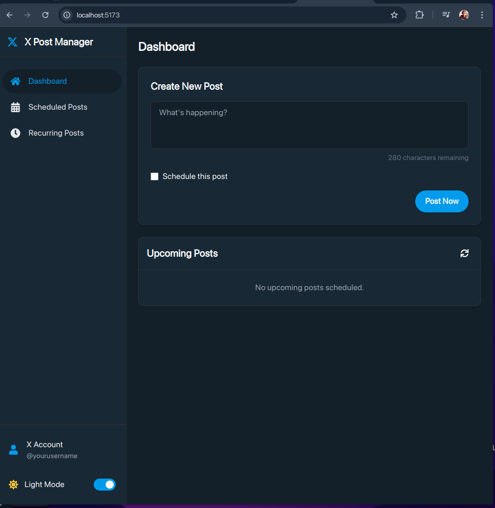
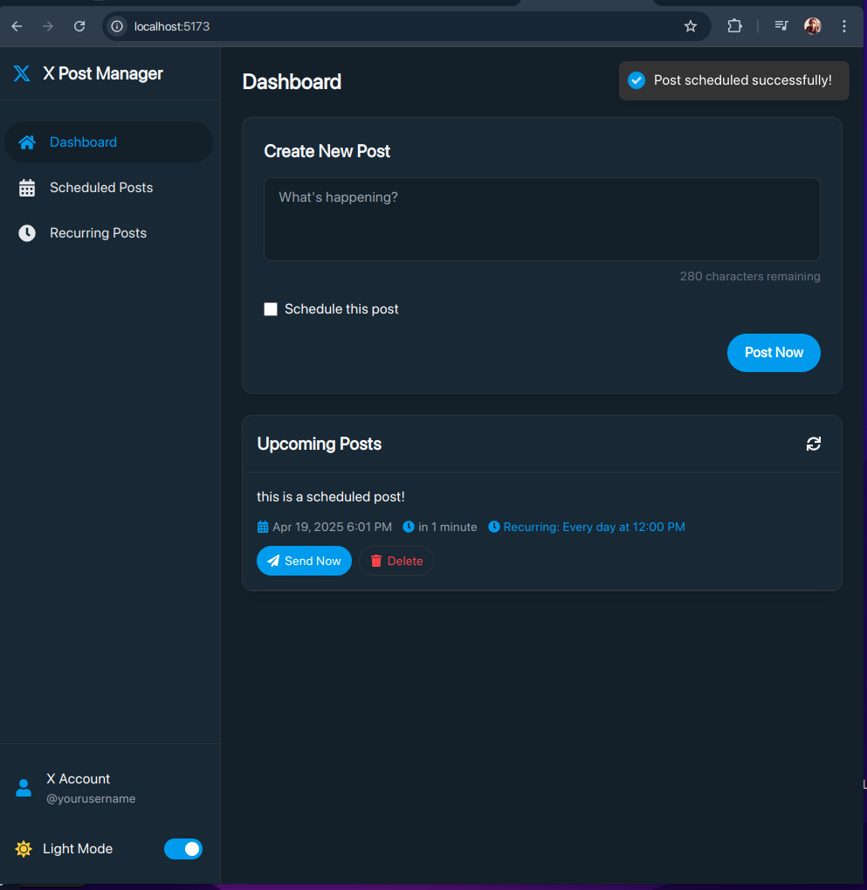
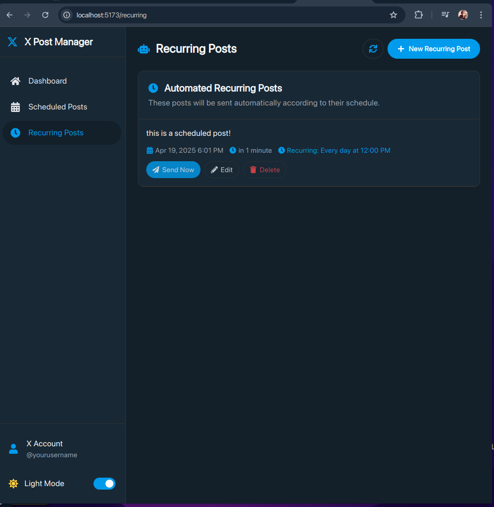

# X Post Manager

A express app for scheduling and managing your X (formerly Twitter) posts responsive UI & powerful features.


## Features

- **Post to X Directly**: Create and send posts to your X account with a single click
- **Schedule Posts**: Plan content for specific dates and times
- **Recurring Posts**: Set up automated posting schedules using cron expressions
- **Dark/Light Mode**: Toggle between X's "dim" mode and light theme
- **Responsive Design**: Fully responsive interface that works on mobile and desktop
- **Modern UI**: Clean, professional interface using X's design language

## Screenshots

### Dashboard
<!-- Place a screenshot of the dashboard here -->

*The main dashboard where you can create new posts and see upcoming scheduled content*

### Scheduled Posts
<!-- Place a screenshot of the scheduled posts screen here -->

*View and manage all your scheduled one-time posts*

### Recurring Posts
<!-- Place a screenshot of the recurring posts screen here -->

*Set up and manage automated posting schedules*

## Technologies Used

- **Frontend**:
  - React 19.0.0
  - Vite 6.3.1
  - React Router Dom 7.5.1
  - Tailwind CSS 3.3.5
  - HeadlessUI 2.2.2
  - React Icons 5.5.0
  - React Datepicker 8.3.0
  - React Hot Toast 2.5.2

- **Backend**:
  - Express 5.1.0
  - Node.js
  - Twitter API V2 (twitter-api-v2)
  - Node Cron for scheduling
  - File-based storage

## Installation

### Prerequisites
- Node.js (v18+)
- npm or yarn
- X Developer Account with API credentials

### Setup and Installation

1. Clone the repository
```bash
git clone https://github.com/jk08y/x-post-manager.git
cd x-post-manager
```

2. Install root dependencies
```bash
npm install
```

3. Install client dependencies
```bash
cd client
npm install
```

4. Install server dependencies
```bash
cd ../server
npm install
```

5. Configure your environment variables
```bash
# Create a .env file in the server directory
cp .env.example .env

# Then edit the .env file with your X API credentials
```

Your `.env` file should contain the following variables:
```
# X API Credentials
TWITTER_API_KEY=your_api_key_here
TWITTER_API_SECRET=your_api_secret_here
TWITTER_ACCESS_TOKEN=your_access_token_here
TWITTER_ACCESS_TOKEN_SECRET=your_access_token_secret_here

# Server Settings
PORT=5000
NODE_ENV=development
```

You can obtain these credentials by:
1. Going to the [X Developer Portal](https://developer.twitter.com/en/portal/dashboard)
2. Creating a new project/app
3. Setting up User Authentication
4. Generating Access Token and Secret
5. Copying these values to your `.env` file

6. Start the development servers
```bash
# From the root directory
npm run dev
```

This will start both the frontend (on port 5173) and the backend (on port 5000) simultaneously.

## Project Structure

```
x-post-manager/
├── client/                      # Frontend - React/Vite
│   ├── public/
│   ├── src/
│   │   ├── components/          
│   │   │   ├── Layout.jsx       
│   │   │   ├── Dashboard.jsx    
│   │   │   ├── CreatePost.jsx   
│   │   │   ├── ScheduledPosts.jsx 
│   │   │   ├── CronScheduler.jsx 
│   │   │   ├── PostDetails.jsx  
│   │   │   ├── PostItem.jsx     
│   │   │   └── ThemeToggle.jsx  
│   │   ├── context/
│   │   │   └── ThemeContext.jsx 
│   │   ├── hooks/
│   │   │   └── useTheme.js      
│   │   ├── App.jsx              
│   │   ├── main.jsx             
│   │   └── index.css            
│   ├── tailwind.config.js       
│   ├── package.json
│   └── vite.config.js
│
├── server/                      # Backend - Express
│   ├── config/
│   │   └── twitter.js           
│   ├── controllers/
│   │   └── postController.js    
│   ├── models/
│   │   └── Post.js              
│   ├── routes/
│   │   └── api.js               
│   ├── utils/
│   │   └── cronJob.js           
│   ├── scheduled_posts/         
│   ├── .env                     
│   ├── package.json
│   └── server.js                
│
├── screenshots/                 
├── .gitignore
├── package.json                 
└── README.md                    
```

## API Endpoints

| Method | Endpoint | Description |
|--------|----------|-------------|
| GET | /api/posts | Get all scheduled posts |
| POST | /api/posts | Create and send a post immediately |
| POST | /api/posts/schedule | Schedule a post for later |
| GET | /api/posts/:id | Get a post by ID |
| PUT | /api/posts/:id | Update a post |
| DELETE | /api/posts/:id | Delete a post |
| POST | /api/posts/:id/send | Send a scheduled post now |

## Usage

### Creating a Post
1. Navigate to the Dashboard
2. Enter your post content in the text area
3. Choose to post immediately or schedule for later
4. For scheduled posts, select a date and time
5. Click "Post Now" or "Schedule Post" button

### Creating a Recurring Post
1. Navigate to the Recurring Posts section
2. Click "New Recurring Post"
3. Enter your post content
4. Select a recurring schedule (e.g., "Every day at 9:00 AM")
5. Click "Create Recurring Post" button

### Managing Posts
- View all upcoming scheduled posts on the Dashboard
- Edit, delete, or send posts immediately using the action buttons
- View all scheduled posts on the Scheduled Posts page
- Manage recurring posts on the Recurring Posts page

## Customization

### Theme Configuration
You can customize the X theme colors in `client/tailwind.config.js`:

```javascript
theme: {
  extend: {
    colors: {
      twitter: {
        blue: '#1d9bf0',
        dark: '#15202b',
        darker: '#1a2836',
        // Add more custom colors here
      }
    }
  }
}
```


## Contributing

Contributions are welcome! Please feel free to submit a Pull Request.

## License

This project is licensed under the MIT License - see the LICENSE file for details.

## About the Author

If you find this project useful, please consider giving it a star on GitHub! ⭐
- [https://github.com/jk08y/x-post-manager](https://github.com/jk08y/x-post-manager).

---

<p align="center">
  <a href="https://github.com/jk08y" target="_blank">
    
  </a>
</p>
<p align="center">
  <a href="https://x.com/jk08y" target="_blank">Let's connect on X </a> 
</p>